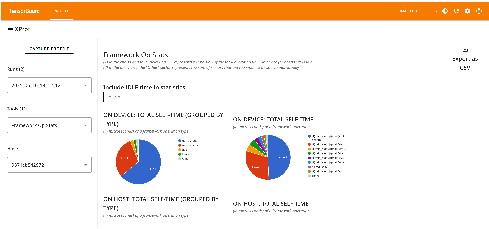

## Framework Op Stats Tool

You can use Framework Op Stats to see the performance statistics of
framework-level operations (e.g., JAX or TensorFlow) executed on the host and
accelerator during the profiling session. This tool is valuable for identifying
potential targets for performance optimization by highlighting the most
time-consuming operations during the profiled period.

### Supported Platforms

Both TPU and GPU are supported.

### Framework Op Stats Components

Framework Op Stats has the following key components:

*   Framework operation statistics table: This is the primary component,
    presenting a detailed breakdown of every framework operation executed during
    the profiling session in a tabular format. There is one row for each
    distinct framework op, and columns that capture various details regarding
    that operation.
    *   Search boxes let you filter by host/device, the operation type, or the
        operation name; the filters select for the provided string that appears
        anywhere within the respective column.

    

*   Summarized charts section: This section has charts that summarize the
    detailed per-op table, in the following ways:
    *   A pair of pie charts (one for the accelerator and one for the host) that
        show the fraction of time consumed by different categories of framework
        ops.
    *   A pie chart that shows the fraction of time consumed by different
        individual framework ops (truncated to the top-N ops, with the remaining
        classified as “Other” to improve readability)

    

*   Summarized tables section: This section has a pair of tables (one for the
    accelerator and one for the host), with the number of occurrences, and total
    time consumed (both in absolute terms and as a fraction of total session
    time) by different categories of framework ops.
*   A drop-down selector lets you decide whether or not to include any idle time
    within the pie charts and summary tables.

    

### Framework Operation Statistics Table Details

You can click any of the column headings to sort the framework operation
statistics table. The default order is based on the total self time of the op
(also labeled “rank” in the table).

The table includes the following information for each operation:

*   **Op execution location:** Whether the operation is executed on host or device.
*   **Framework op type:** These are derived directly from the operation name string
    (the last part of the call stack), to help with easy sorting.
*   **Framework op name:** This is derived from the framework level metadata passed
    along to XProf by XLA.
*   **Occurrences:** The total number of times this specific framework operation was
    executed during the profiling period.
*   **Total time (μs):** The cumulative time spent executing this operation across
    all of its occurrences. If this operation has any child operations, this
    time includes the time spent in those children.
*   **Average time (μs):** The average time per execution of this operation,
    including any time spent in children ops, if any.
*   **Total self time (μs):** The cumulative time spent solely within the body of
    this HLO operation, excluding any time spent in its children operations.
*   **Average self time (μs):** The average time per execution of this operation,
    excluding any time spent in its children operations.
*   **Total self time on Device (%):** The self time of the op as a percentage of
    the total time on the device across all ops.
*   **Cumulative total self time on device (%):** A running sum of total self time
    (%) for all ops that appear earlier in the currently sorted order.
*   **Total self time on host (%):** The self time of the op as a percentage of the
    total time on the host across all ops.
*   **Cumulative total self time on host (%):** A running sum of total self time (%)
    for all ops that appear earlier in the currently sorted order.

You can use the **Export as CSV** button on the right side of the upper pane to
export the data from this table as a CSV file, and use the pretty-print checkbox
for a more human-friendly presentation.

