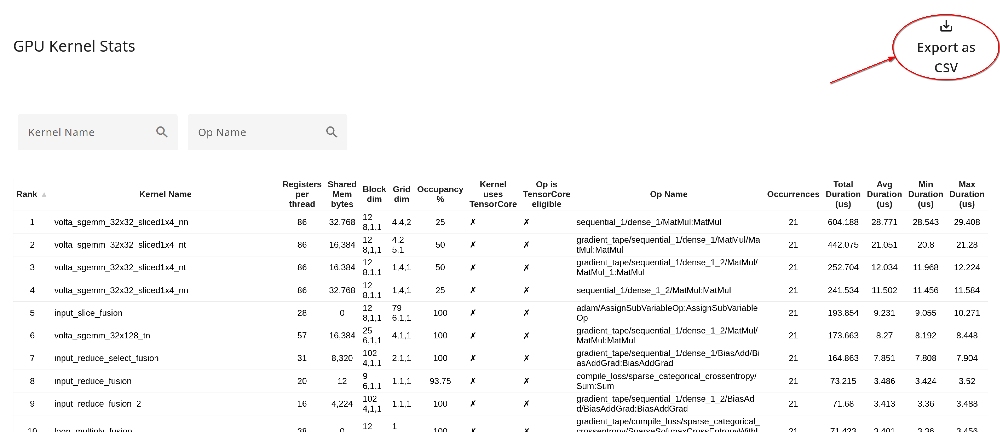

## GPU Kernel Stats Tool

You can use the GPU Kernel Stats tool to see performance statistics and the
originating framework operation for every GPU-accelerated kernel that was
launched during a profiling session. This tool helps identify potential
bottlenecks at a low level and surfaces optimization opportunities.

### Supported Platforms

The GPU Kernel Stats tool is only supported on GPUs.

### Interface Components

The GPU Kernel Stats tool interface is a table with one row for each unique
kernel-framework operation pair. You can click any of the column headings to
sort the table accordingly. The default order is based on the total duration of
the kernel-op pair.

The GPU Kernel Statistics Table includes the following information for each kernel-op pair:

*   **Kernel name:** The name of the kernel that was launched.
*   **Registers per thread:** The number of GPU
    [registers](https://docs.nvidia.com/cuda/cuda-c-programming-guide/index.html#hardware-multithreading)
    used by the kernel per thread.
*   **Shared memory used:** The total size of
    [shared memory](https://docs.nvidia.com/cuda/cuda-c-best-practices-guide/index.html#shared-memory)
    used by the kernel in bytes.
*   **Block dimension:** The dimensions of the thread block expressed as blockDim.x,
    blockDim.y, blockDim.z.
*   **Grid dimensions:** The dimensions of the grid of thread blocks expressed as
    gridDim.x, gridDim.y, gridDim.z.
*   **Theoretical occupancy:** The theoretical
    [occupancy](https://docs.nvidia.com/cuda/cuda-c-best-practices-guide/index.html#occupancy)
    of the GPU expressed as a percentage. This is an indication of the ability
    to hide memory latency.
*   **Kernel uses Tensor Core:** A heuristic indicating whether the kernel itself
    contains Tensor Core instructions, based on the presence of common Tensor
    Core instructions.
*   **Tensor Cores eligibility:** A heuristic indicating whether the originating
    framework operation is eligible to use Tensor Cores, based on commonly
    occurring ops that employ the Tensor Core.
*   **Op name:** The name of the framework operation that launched this kernel.
*   **Occurrences:** The number of times this specific kernel-operation pair was
    executed during the profiling period.
*   **Total duration (us):** The cumulative sum of the execution time of all
    occurrences of this kernel-operation pair.
*   **Average duration (us):** The average execution time across all occurrences of
    this kernel-operation pair.
*   **Minimum duration (us):** The shortest execution time observed for this
    kernel-operation pair.
*   **Maximum duration (us):** The longest execution time observed for this
    kernel-operation pair.
*   Search boxes let you filter rows by **GPU Kernel Name** or by **Op Name**.
*   You can export the table to a CSV file by clicking the "Export as CSV" button.

