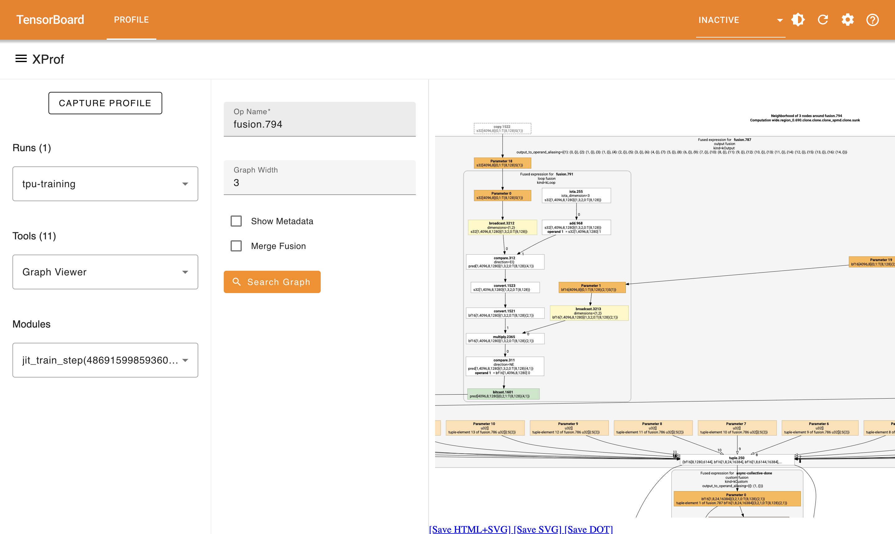

## Graph Viewer Tool

You can use Graph Viewer to visualize the graph structure of your XLA program.
It displays the High Level Operations (HLO) graph.

### Supported Platforms

Both TPU and GPU are supported.

### Interface Components

Graph Viewer can be controlled with the following options:

1. An **Op Name** box, where you enter the name of an
operation to select it as the primary node and visualize its neighbors. Pressing
enter after typing the op name will visualize the surrounding nodes.

1. A **Graph Width** selector, which
controls the maximum distance of nodes from the primary node that is included in
the visualization.

1. A **Metadata** selector, which you
use to toggle the display of operation metadata included by the compiler, if
any. Note that you need to click “Search Graph” again after selecting this
checkbox.

1. A **Merge Fusion** checkbox that you can use to collapse or expand the
components of fused ops. Note that you will need to click “Search Graph” again
after toggling this checkbox.

1. Zoom in/out buttons or keys, though you can
also use your mouse to zoom.

1. Links to download the graph as SVG or dot files.

1. By using the search functionality, you can quickly locate and focus on
specific operations within the potentially large graph.

1. To freeze the runtime
data panel on a particular op, right click on the op.

### Using Graph Viewer

By default, no operations are selected in Graph Viewer, so you will see an empty
screen. Search for the operation of interest to zoom into it and begin
traversing the graph. Often, you start with one of the other tools. For example,
from [Op Profile](hlo_op_profile.md) to identify the most time consuming op, or
[Trace Viewer](trace_viewer.md) to identify the cause of a pipeline bubble.
Clicking the op in those tools will give you a direct link into the same op
within Graph Viewer.

By hovering over a box (representing an HLO operation), you might often see the
line of your user code corresponding to the op where the function was defined.
This information is only available if this metadata is provided to XProf through
the
[multiple layers of transformation](https://openxla.org/xla/architecture#how_it_works)
that your Python program undergoes on its way to generating an accelerator
executable.

Note that the profiler receives HLO-level information from an “optimized HLO”
graph, close to the point where it is ready to be lowered to
accelerator-specific code by the compiler backend. Graph Viewer, and indeed all
XProf tools, therefore handle this low-level XLA-internal HLO representation,
rather than StableHLO or a representation close to the ML framework.

While the graph itself is purely static, and is directly acquired from XLA even
without executing the program, Graph Viewer overlays additional runtime
information on the graph to make it more useful. For example, hovering over an
op brings up a section on the left side of the UI indicating how many times that
op was executed in the profile duration, and what the average execution time
was. It also computes and displays various utilization and bandwidth numbers;
these take the static cost analysis from XLA for FLOPS and bytes consumed, and
compute a rate based on the measured execution time.
