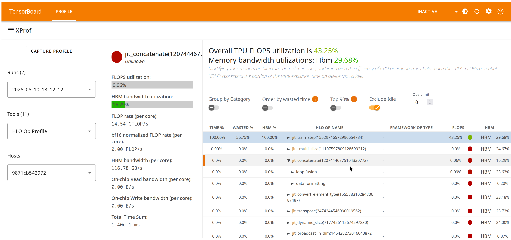

## HLO Op Profile Tool

You can use the HLO Op Profile tool to understand hardware performance for
different categories of High Level Operation (HLO) ops executed during the
profiling period.

### Supported Platforms

Both TPU and GPU are supported.

### Using the HLO Op Profile tool

HLO Op Profile has the following components:

1.  The overview at the top of the page provides a summary of overall
    utilization of the accelerator compute FLOPs and the HBM bandwidth during
    the profiling period.
2.  The table below provides a more granular view of utilization. It categorizes
    the HLO ops executed by each module during the profiling period, and you can
    traverse the hierarchy and view utilization per module, per category within
    a module, or per op within a category. Fusion operations can be further
    expanded to show the non-fusion, element-wise operations that they contain.
    *   The categorization is defined mostly by the XLA compiler, with XProf
        employing additional heuristics in certain scenarios (e.g., it parses
        the HLO graph to identify “convolution fusions”).
    *   By default, the list of modules, categories, and ops is sorted by the
        fraction of total time spent on executing the module, category, or op.
        You may instead choose to sort by ops that cause the most
        under-utilization of the hardware (utilization weighted by the op’s
        runtime, or “wasted time”). By identifying operations with low FLOPS
        utilization and high time consumption, you can target them for
        optimization.
3.  Hovering over an operation in the table brings up a card on the left side
    displaying more details about the op or the operation category. Clicking a
    table entry pins the op detail card. These cards typically include the
    following, as appropriate:
    *   A link to the op in the Graph Viewer tool.
    *   Average execution time.
    *   Absolute rates of usage (in contrast with utilization reported in the
        table) of the compute (TFLOP/s), HBM bandwidth (GB/s), and on-chip read
        and write bandwidth (GB/s).
    *   The full XLA op details including details regarding various shapes and
        layouts.
    *   The provenance of the XLA op at the framework level.
    *   The number of occurrences of the op, and total time spent on the op in
        aggregate.

Note that raw bandwidths (GB/s) or compute rates (TFLOP/s) are computed by
combining static compiler data on FLOPs or bytes required for the op (the
numerator) with duration information per op from the profile (the denominator).
Utilization numbers (percentages) are computed by computing the absolute
resource consumption data as a fraction of peak compute or peak bandwidth
capabilities per accelerator.
