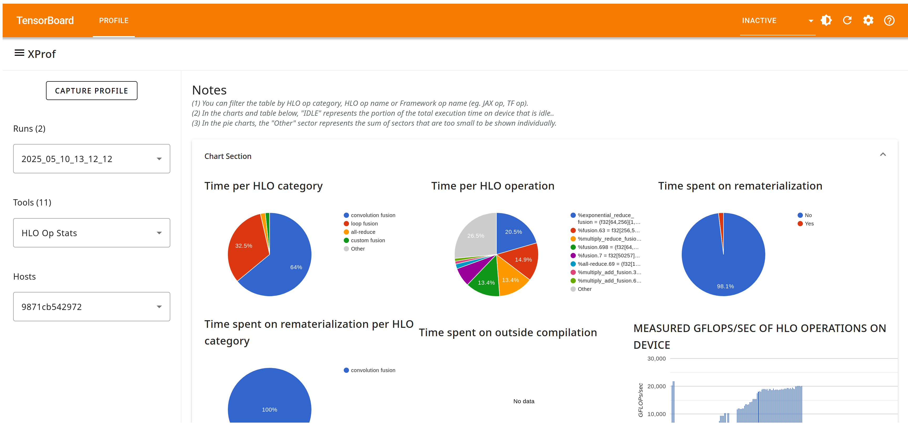

## HLO Op Stats Tool

You can use HLO Op Stats to see the performance statistics of High Level
Optimizer (HLO) operations executed during a profiling session. This tool is
valuable for identifying potential targets for performance optimization by
highlighting the most time-consuming operations within your HLO graph during the
profiled period.

### Supported Platforms

Both TPU and GPU are supported.

For GPUs, HLO ops have an N:M relationship with the kernels that actually get
executed. For statistics at the kernel level, see the
[GPU Kernel Stats](gpu_kernel_stats.md) tool.

### HLO Op Stats Tool Components

The HLO Op Stats tool has the following key components:

*   HLO Operation Statistics Table: This is the primary component, presenting a
    detailed breakdown of every HLO operation executed during the profiling
    session in a tabular format. There is one row for each distinct HLO
    operation, and columns that capture various details regarding that
    operation.
    *   A drop-down selector lets you decide which columns you want to visualize
        for every HLO op.
    *   You can also filter rows by HLO Op category via a second drop-down
        selector.
    *   Search boxes let you filter by specific program IDs, HLO ops, the HLO op
        text, or the framework op name; the filters select for the provided
        string appearing anywhere within the respective column.
*   Summarized Charts Section: This section has charts that summarize the
    detailed per-op table, in the following ways:
    *   A pie chart that shows the fraction of time consumed by different
        categories of HLO ops.
    *   A pie chart that shows the fraction of time consumed by different
        individual HLO ops (truncated to the top-N ops, with the remaining
        classified as “Other” to improve readability).
    *   A pie chart that shows the fraction of total time spent on ops that are
        part of rematerialization; XProf receives this information from compiler
        metadata associated with the profile.
    *   A pie chart that shows HLO op categories where the rematerialization
        time (if any) goes.
    *   Time spent on outside compilation: Outside compilation is a TensorFlow
        feature that enables certain ops within an XLA computation to
        transparently run on the host CPU rather than the accelerator device
        (e.g., `tf.summary` or `tf.print` that requires I/O access that the device
        does not possess).
    *   A chart plotting the GFLOPS/s for all HLO operations, ordered by total
        self time.
    *   For TPUs only, time per HLO by replica group: A drop down lets you pick
        from the different collective operations executed during the profiling
        session. Different instances of that collective op may have been
        executed among different replica groups (e.g.,
        [AllGather](https://openxla.org/xla/operation_semantics#allgather)); a
        pie chart shows the distribution of time between these different
        instances.

### HLO Operation Statistics Table Details

You can click any of the column headings to sort the HLO operation statistics
table. The default order is based on the total self time of the op (labeled
“rank” in the table).

The table includes the following information for each HLO operation:

*   Program ID: An identifier for the HLO module this op is associated with
*   HLO Op category: These are largely defined by the XLA compiler; XProf
    additionally employs heuristics to identify and categorize certain
    operations (e.g., convolution fusions).
*   Operation Name: The unique name assigned to the HLO operation by the XLA
    compiler.
*   HLO Op text: Provided by the XLA compiler, and includes details such as the
    types and shapes of inputs/parameters.
*   Framework op name: The operation at the framework level (e.g., JAX) that
    resulted in this HLO op getting generated.
*   Occurrences: The total number of times this specific HLO operation was
    executed during the profiling period.
*   Total time (μs): The cumulative time spent executing this operation across
    all its occurrences. If this operation has any child operations (e.g.,
    within a fusion), this time includes the time spent in those children.
*   Average time (μs): The average time per execution of this HLO operation,
    including any time spent in children ops, if any.
*   Total self time (μs): The cumulative time spent solely within the body of
    this HLO operation, excluding any time spent in its children operations.
*   Average self time (μs): The average time per execution of this HLO
    operation, excluding any time spent in its children operations.
*   Total self time (%): The self time of the op as a percentage of the total
    time on the device across all ops.
*   Cumulative total self time (%): A running sum of total self time (%) for all
    ops that appear earlier in the “rank” order.
*   DMA stall (%): The percentage of the total time during which the operation
    was stalled due to Direct Memory Access (DMA) operations.
*   Bandwidth consumption (usage/sec) for FLOPs, HBM, and internal TPU memories
    if available (e.g., CMEM is only present on TPU v4). These are all computed
    using the compiler’s static cost analysis (numerator), and profiled
    execution time (denominator).
*   Model GFLOPS/s: The GFLOPs cost is computed by the XLA compiler, and time is
    measured by the profile.
*   Normalized GFLOPS/s: Normalizes the compiler-computed FLOPs on a per-op
    basis based on its numerical precision, and the peak FLOPs supported by the
    device for different precisions. For example, TPU v6e supports double the
    peak FLOPs at int8 than it does at bf16; XProf normalizes to bf16 by
    default.
*   Memory BW: The number of bytes/s consumed by the op, from any memory (e.g.,
    on-chip TPU VMEM and HBM). The XLA compiler provides the “bytes” number and
    the duration is measured in the profile.
*   HBM BW: The number of bytes/s specifically consumed from HBM.
*   Operational intensity: Calculated as the ratio of FLOPS per bytes, as
    defined for roofline analysis.
*   Compute/Memory bound: Based on the Roofline Model, this column indicates
    whether the operation's performance is primarily limited by compute
    capabilities or memory bandwidth.
*   Rematerialization: Indicates if the op was part of a rematerialization.
*   Outside compilation: Indicates if the op ran on the host CPU using
    Tensorflow’s outside compilation facility.
*   Autotuned: Indicates if the op was auto-tuned by XLA. For more information,
    see [Autotuning](https://openxla.org/xla/tools#autotuning) and
    [Persisted Autotuning](https://openxla.org/xla/persisted_autotuning).
