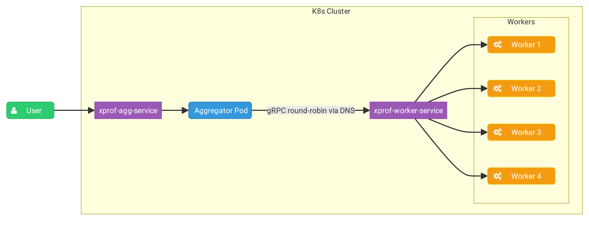

# XProf Kubernetes deployment for Distributed Profiling

This document describes how to deploy XProf in a distributed setup on
Kubernetes, using separate deployments for workers and an aggregator.



## Prerequisites

*   A Kubernetes cluster.
*   A Docker image of XProf. See
    [Building an XProf Docker Image](docker_deployment.md) for instructions on
    how to build one.

## Kubernetes Configuration

The following YAML configurations define Kubernetes deployments and services for
XProf workers and an aggregator.

The aggregator deployment runs a single replica that receives user requests and
distributes profiling tasks to the worker replicas using a round-robin policy.
The `--worker_service_address` flag configures the aggregator to send requests
to the worker service.

The worker deployment runs multiple replicas, each exposing a gRPC port via the
`--grpc_port` flag to listen for processing tasks from the aggregator.

**Note**: The port numbers used in the YAML configurations below (e.g., HTTP
port `10000` for the aggregator, gRPC port `8891` for workers) are examples and
can be customized to fit your environment.

**Note**: This configuration uses gRPC's DNS resolver with a headless Kubernetes
service (`clusterIP: None`) for worker discovery and relies on gRPC's
`round_robin` load-balancing policy. This setup is incompatible with Kubernetes
Horizontal Pod Autoscaling (HPA) for worker pods because dynamic changes in
replica counts may not be correctly propagated to the aggregator.

### Aggregator

```yaml
apiVersion: apps/v1
kind: Deployment
metadata:
  name: xprof-aggregator-deployment
  labels:
    app: xprof-aggregator-app
spec:
  replicas: 1
  selector:
    matchLabels:
      app: xprof-aggregator-app
  template:
    metadata:
      labels:
        app: xprof-aggregator-app
    spec:
      containers:
      - name: aggregator-container
        image: <your-xprof-docker-image>
        imagePullPolicy: Always
        env:
        - name: GRPC_LB_POLICY
          value: "round_robin"
        - name: GRPC_DNS_RESOLVER
          value: "native"
        args:
          - "--port=10000"
          - "--worker_service_address=dns:///xprof-worker-service.default.svc.cluster.local:8891"
          - "-gp=50051"
          - "--hide_capture_profile_button"
        ports:
        - containerPort: 10000

---
apiVersion: v1
kind: Service
metadata:
  name: xprof-agg-service
  labels:
    app: xprof-aggregator-app
spec:
  selector:
    app: xprof-aggregator-app
  clusterIP: None
  ports:
  - protocol: TCP
    port: 80
    targetPort: 10000
```

### Worker

```yaml
apiVersion: apps/v1
kind: Deployment
metadata:
  name: xprof-worker-deployment
  labels:
    app: xprof-worker-app
spec:
  replicas: 4
  selector:
    matchLabels:
      app: xprof-worker-app
  template:
    metadata:
      labels:
        app: xprof-worker-app
    spec:
      containers:
      - name: worker-container
        image: <your-xprof-docker-image>
        imagePullPolicy: Always
        args:
          - "--port=9999"
          - "-gp=8891"
          - "--hide_capture_profile_button"
        ports:
        - containerPort: 8891

---
apiVersion: v1
kind: Service
metadata:
  name: xprof-worker-service
  labels:
    app: xprof-worker-app
spec:
  selector:
    app: xprof-worker-app
  clusterIP: None
  ports:
  - protocol: TCP
    port: 80
    targetPort: 8891
```
