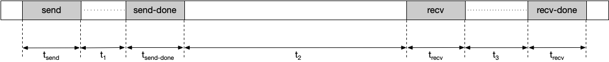

## Megascale Stats Tool

You can use the Megascale Stats tool to analyze inter-slice communication
performance of workloads spanning multiple TPU slices that communicate across
the Data Center Network (DCN).

All metrics displayed in the Megascale Stats tool are generated on a per-TPU
basis.

### Supported Platforms

TPU: Supported

GPU: Not supported

### Terminology Related to Collectives

The tool displays metrics related to communication between TPU slices, which
involve the following operations:

*   `send`: Interrupts the host to start Direct Memory Access (DMA) and provides
    a filled buffer to the host to start data transfer.
*   `send-done`: Signals the host that the data transfer is completed.
*   `recv`: Provides an empty buffer for the host to fill with the transferred
    data.
*   `recv-done`: Signals the host that the data has been received.

A **collective** is initiated by a `send` operation and completed by the
matching `recv-done` operation. The actual sending of data occurs after the send
operation is completed. The `send-done` operation occurs after the data has been
sent. Likewise, data is received after the `recv` operation is completed. The
`recv-done` operation occurs after the data is received.

#### Interface Components

The tool displays a table with the following columns, with one row for each
profiled collective operation:

*   DCN collective name: Assigned by XLA.
*   Recv op name: The TPU `recv-done` operation name. This provides an easy way
    to search Trace Viewer for the corresponding collective TPU operations.
*   Send op name: The TPU `send` operation name.
*   Slack time: Defined as the network independent time the collective has to
    transmit the data. It is a measure of the time the collective has available
    to send and receive data, excluding the `send`, `send-done`, `recv`, or
    `recv-done` operations. Increasing slack time reduces the chances of
    stalling the TPU for a collective. For example, given the following
    timeline:


```
Slack time is calculated in this example as:

Slack time = t<sub>1</sub> + t<sub>2</sub> + t<sub>3</sub>
```

*   Observed duration: The duration observed for each collective. It is computed
    as the interval between the start of the `send` operation to the end of the
    corresponding `recv-done` operation, including the time spent sending and
    receiving data. For example, given the following timeline:


```
Observed duration is calculated as:

Observed duration = t<sub>send</sub> + t<sub>1</sub> + t<sub>send-done</sub> + t<sub>2</sub> + t<sub>recv</sub> + t<sub>3</sub> + t<sub>recv-done</sub>
```

*   Stall Duration: The duration of time the collective stalls the TPU. This is
    the total duration of time the collective spends in the `send`, `send-done`,
    `recv`, and `recv-done` operations, not including the time spent
    transmitting data. For example, given the following timeline:



```
Stall duration is calculated in this example as:

Stall duration = t<sub>send</sub> + t<sub>send-done</sub> + t<sub>recv</sub> + t<sub>recv-done</sub>
```

*   Occurrences: The total number of times a collective is initiated and
    completed during a profile duration. The `send` operation and its matching
    `recv-done` operation must occur within the profile duration to be included
    in this metric.
*   Aggregated total stall: The total amount of time a collective stalls a TPU
    during a profile duration. Aggregation total stall is calculated as:
    *   Aggregated total stall = stall duration \* occurrences
*   Data transmitted size: The amount of data that is transmitted over the
    network for the collective, computed based on the XLA operation shape.
*   Required bandwidth: The bandwidth required to transmit the data within the
    provided slack. You can use this metric to see the number of collectives
    competing for network bandwidth during the profile duration. Required
    bandwidth is computed as:
    *   Required bandwidth = data transmitted size / slack time

#### Analyzing Megascale Stats Tool Data

To analyze the data presented in the tool:

1.  Sort the table by `Aggregated Total Stall` in descending order.
2.  Identify the DCN collective name with the highest `Aggregated Total Stall`.
    A significantly high value compared to others may indicate a bottleneck.
3.  Multiply the `Required Bandwidth` of the DCN collective by the number of
    cores (e.g., 8 per v4 TPU host). If this value is greater than the maximum
    network bandwidth of the TPU, it may indicate network congestion. Try
    changing the
    [sharding](https://cloud.google.com/tpu/docs/multislice-introduction#optimize)
    mechanism to reduce the required bandwidth.
4.  Generate an HLO dump to check for compiler issues. Fanning out `send` and
    `recv-done` operations can allow for scheduling more overlapping HLO
    operations and reduce TPU stall time.
5.  Check the duration of `recv-done` operations in Trace Viewer for the
    collective with the maximum aggregated total stall. A high transfer duration
    could indicate a bandwidth bottleneck as `recv-done` operations are usually
    blocked on the network.
6.  If the duration of `recv-done` operations is not excessively high compared
    to the slack time, it might suggest a hardware issue.
