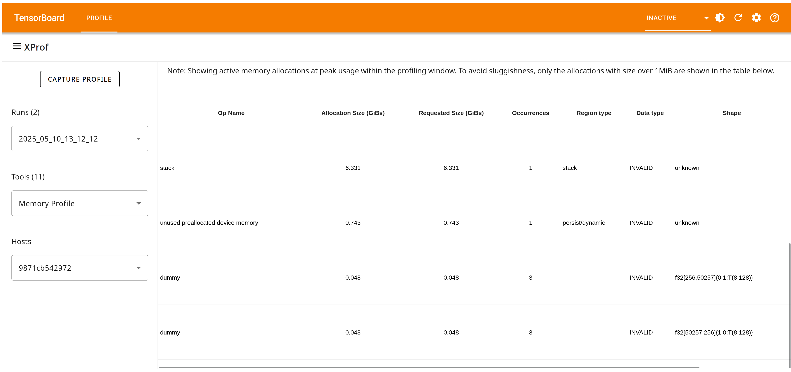

## Memory Profile Tool

You can use Memory Profile to visualize the memory usage over time of your
accelerators. The Memory Profile tool monitors the memory usage of your device
during the profiling interval. You can use this tool to:

*   Debug out of memory (OOM) issues by pinpointing peak memory usage and the
    corresponding memory allocation to framework ops.
*   Debug memory fragmentation issues.

### Supported Platforms

Both TPU and GPU are supported.

### Using the Memory Profile Tool

Memory Profile has the following components:

*   The **Host ID** selector at the top of the page lets you choose between
    different hosts to profile.
*   The **Memory ID** selector at the top of the page lets you focus on the High
    Bandwidth Memory (HBM) attached to one of the different accelerators that
    may be connected to the host being profiled, or even the host memory in
    certain cases.

    

*   The **Memory Profile Summary** and the **Memory Timeline Graph** capture
    high-level information about memory allocations, deallocations, and usage
    during the profiling session, including breakdowns across stack and heap,
    and any impact of fragmentation.

    *   The **Memory Profile Summary** shows the total number of allocations and
        deallocations during the profiling interval; the total memory capacity
        of the memory system selected; the lifetime peak heap usage since the
        model started running (note that this may be outside the profiling
        interval); and the peak memory usage within the profiling interval.

        

    *   The **Memory Timeline Graph** shows a plot of the memory usage over time
        (represented by the Y-axis on the left of the graph) and the percentage
        of fragmentation over the profiling interval (represented by the Y-axis
        on the right of the graph). At each point in time on the X-axis, the
        total memory is broken down into three categories: stack (in red), heap
        (in orange), and free (in green). Hover over a specific timestamp to
        view the details about the memory allocation/deallocation events at that
        point like below: 

*   The **Memory Breakdown Table** provides information about framework-level
    ops that contribute the most to memory usage. There are also additional
    per-op details such as the shape, data type, etc., if this information is
    made available by the compiler to XProf. The table shows these details at
    the point of peak usage within the profiling window, to aid with debugging
    Out of Memory (OOM) situations.

Allocations and deallocations are managed (and added to the profile) by XLA’s
runtime allocator, which owns the entire HBM memory space.

The fragmentation metric in the memory profile summary and the memory timeline
graph (as a percentage) help identify memory fragmentation issues. A high
fragmentation value indicates that although there might be enough total free
memory, it is not contiguous, and thus a large allocation request might fail.

Note that Memory Profile is typically more interesting and valuable for GPU
profiling than for TPU workloads. The TPU execution model typically involves a
large upfront allocation by the XLA compiler, rather than during model training
or inference. Therefore, you will often see that the allocation chart looks like
a flat horizontal line; the allocations all likely occurred at the very
beginning of the profile (if the profiler was active by that point in the run),
making them hard to see.

Some key differences between this tool and the
[Memory Viewer tool](memory_viewer.md):

*   Memory Viewer is purely static and focuses on program order; Memory Profile
    provides a dynamic view over time during the profiling interval.
*   Memory Viewer visualizes memory allocations on a per-XLA-module basis; for
    workloads consisting of multiple XLA modules, Memory Profile provides a
    global view of memory.
