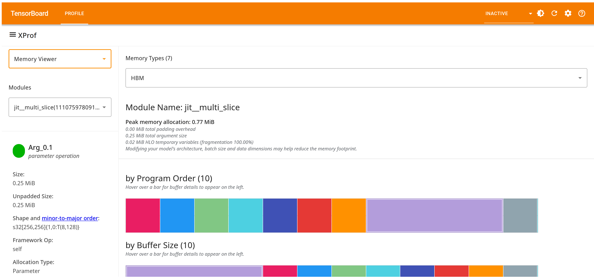

## Memory Viewer Tool

You can use Memory Viewer to visualize memory usage over the program's lifetime.
You can dive into the details of the contents of memory at the point of peak
memory usage, including to debug Out Of Memory (OOM) situations. Memory Viewer
can help you see the global memory usage and how close the computation is to
being out of memory.

All information displayed in Memory Viewer is purely static, obtained from the
XLA compiler; dynamic runtime information is presented in the
[Memory Profile tool](memory_profile.md).

### Supported Platforms

Both TPU and GPU are supported.

### Memory Viewer Components

The Memory Viewer tool consists of several key components:

1.  User control dropdowns that let you customize the data that you’re
    visualizing:
    *   **Memory types:** The supported memory types are accelerator-dependent. For
        GPUs, the focus is on the High Bandwidth Memory (HBM), whereas for TPUs,
        you can additionally view usage for on-chip memories including VMEM,
        SMEM, CMEM, Sync Flags (SFlag), Sparsecore, and also the Host memory.

        

    *   **HLO Modules:** These are the XLA programs that were part of your execution. A
        good starting point is often a top-level module, labeled something like
        `jit_train_step` or `jit_generate`. This dropdown appears at the left
        panel.

        

2.  The textual overview section provides high level information such as the
    peak memory allocation required for the program, the split between arguments
    vs. temporary variables, etc. There is overhead imposed by padding,
    necessitated by restrictions on the supported shapes of tensors on
    accelerators. If this padding is a large fraction of the total allocation,
    that may indicate an optimization opportunity.

    

3.  The **Memory Allocation Size vs. Program Order** line chart plots memory
    usage versus program points (HLO Sequence) as scheduled by the compiler.
    *   Note that the x-axis is *not* time.
    *   The chart specifically highlights the point in the program with peak
        memory utilization *of the chosen module*. The profiler and tools are
        unaware of the co-residence of modules on a given chip/memory. When each
        module is compiled, the compiler annotates the profile with the
        “baseline” starting point of the total allocated memory (by modules that
        were compiled prior to this one), and counts up and down from there as
        further allocations and deallocations occur. However, any future
        allocations by other modules compiled prior to execution are not
        captured; keep this in mind while debugging OOM situations.
4.  Buffer charts at the bottom of the page break down memory usage at the peak
    usage program point (indicated by the vertical line in the memory usage line
    chart). There are three charts, all showing the entire set of buffers
    allocated by the program, but sorted three different ways:

    *   By program order: the order they came to life during program execution,
        with the oldest ones appearing on the left.
    *   By size: the ones with the largest impact on the peak memory usage point
        are on the left.
    *   By the padding overhead they impose: the most “inefficient” from a
        hardware perspective appear on the left.

        Note that the colors of the buffers have no particular meaning.

5.  Clicking on the "timeline" link next to the chart title brings up a
    visualization of the memory allocations, with a series of colored boxes, one
    per allocation. Hovering over the block brings up additional information
    about the allocation; for example, the HLO op that created the allocation,
    the shape of the allocation, etc. The visualization may be interpreted as
    follows:

    *   The x-axis is the program order.
    *   The height of each block on the y-axis is the size of the allocation.
    *   The width of each block is the lifetime of the allocation, in terms of
        program order.

6.  Hovering over a buffer in any of the three charts brings up two additional
    displays:

    *   An overlay on the memory usage line chart in a color that matches the
        buffer card, indicating the lifetime of that buffer; i.e., a horizontal
        bar whose left and right edges indicate the allocation and deallocation
        points, within the program order. The height of the horizontal bar
        represents the relative size of the selected buffer compared to the peak
        allocation.
    *   A separate buffer details card, typically on the left side, with details
        about the specific op as applicable. A typical card includes the
        following information:
        *   Name: The XLA operation name, that you can search for in Graph
            Viewer or Trace Viewer.
        *   Size: The size of the buffer allocation, with and without padding.
        *   Shape: Describes the rank, size, and data type of the N-dimensional
            array.
        *   Framework op name: Shows the framework operation name associated
            with this allocation.
        *   Allocation type: Categorizes the buffer allocations into the
            following types: Parameter, Output, Thread-local, and Temporary
            (e.g., buffer allocation inside a fusion).

