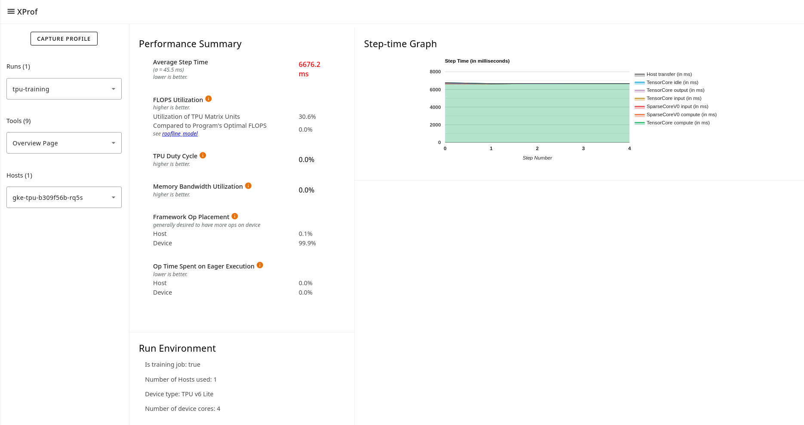

## Overview Page

The overview page provides an aggregated top-level view of how your model
performed during a profile run, how well it utilized hardware resources, and
where time was spent. The overview page acts as a starting point to pursue more
detailed analysis using the other tools within XProf.

The Overview page shows two main sections:

*   **Performance Summary** displays details on the average step time, the ratio
    of framework ops executed on the host vs. the device, the percentage of time
    spent on eager execution, and device compute precisions.
*   **Step-time Graph** displays a graph of device step time (in milliseconds)
    over all the steps sampled. Each step is broken into the multiple categories
    (with different colors) of where time is spent.

### Supported Platforms

Both TPU and GPU are supported.

The overview page adapts the information it shows based on the type of
accelerator being profiled. For TPUs, for instance, it shows a matrix-unit
(MXU) utilization number (training only) based on hardware performance counters,
whereas for GPUs, it shows a breakdown of time spent on kernel launches vs.
compute.

### Key Details for the Overview Page

*   XProf differentiates training and inference profiles by examining them for
    the presence of specific XLA ops that are executed during backpropagation;
    it then automatically adapts the information presented on the overview page
    accordingly.
*   For training runs, step time computation works best if the user program
    explicitly annotates steps in the training loop. In the absence of this
    explicit information, XProf employs heuristics to estimate the step time,
    with potentially lower accuracy.
*   Support for an overview of inference runs is currently work-in-progress;
    some data may be incorrect.
