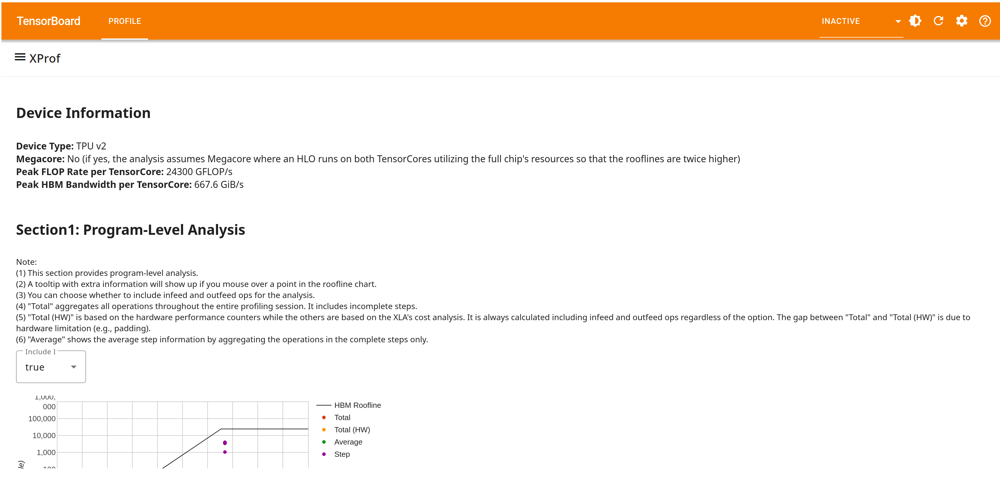
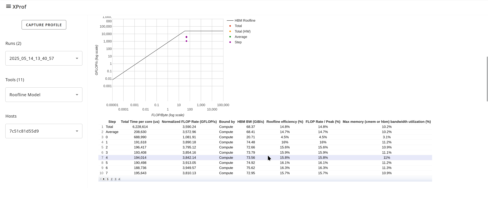
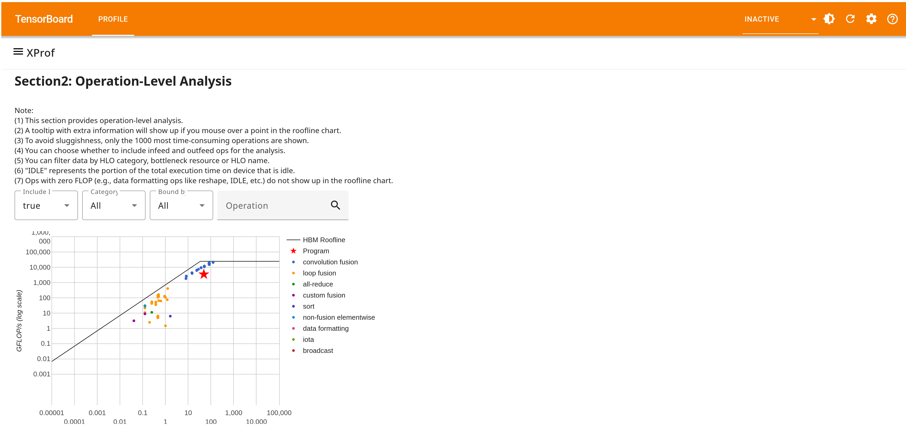

## Roofline Model Tool

The Roofline Model tool offers an intuitive visual performance model that you
can use to understand the inherent hardware limitations impacting your program’s
performance. Specifically, it focuses on whether the program is memory-bound or
compute-bound, and how close the program's performance is to the hardware's
theoretical peak performance, represented as a "roofline".

### Supported Platforms

Both TPU and GPU are supported, with GPU support in beta.

### What is the Roofline Chart

The roofline chart visualizes the relationship between operational intensity
(FLOPS per byte accessed) and achieved FLOPS per second.

$$
Roofline = min(Operational Intensity \times Peak Memory Bandwidth, Peak FLOPS)
$$

The "roof" shape is formed by the lower of the peak FLOPS and the performance
achievable given the memory bandwidth and operational intensity. The ridge point
indicates the minimum operational intensity required to achieve peak FLOPS.

You can learn more about roofline models in [Roofline: An Insightful Visual
Performance Model for Floating-Point Programs and Multicore
Architectures](https://users.cs.duke.edu/%7Elkw34/papers/roofline-cacm2008.pdf),
or in the [Roofline model](https://en.wikipedia.org/wiki/Roofline_model) topic
on Wikipedia.

### Interpreting the Roofline Chart

By plotting the operational intensity and achieved FLOPS for different steps,
parts of the program, or individual HLO operations on the roofline chart, you
can gain insights into performance bottlenecks:

*   If a data point lies on the slanted part of the roofline, the performance is
    likely limited by memory bandwidth (memory-bound). Increasing the
    operational intensity (performing more computation per byte of data
    accessed) could potentially improve performance.
*   If a data point lies on the flat part of the roofline, the performance is
    likely limited by the compute capability (compute-bound). In this case,
    further increasing operational intensity may not lead to significant
    performance gains unless the peak FLOPS of the hardware can be better
    utilized.
*   The distance of a data point from the roofline indicates the potential for
    performance improvement. A larger distance suggests that there are
    opportunities to optimize the program to better utilize the hardware's
    capabilities.

### Interface Components

The Roofline Analysis tool interface has several key components:

*   **Device Information**: This section describes the hardware specs; these are
    used to statically draw the “roofline(s)” on the chart
*   **Section 1: Program-Level Analysis:**

    *   A program-level roofline chart with data points corresponding to the
        following:
        *   The total profile duration.
        *   The total profile duration, but with FLOPS/s data derived from
            hardware performance counters rather than the default cost models
            computed by the XLA compiler.
        *   An average of the complete steps that executed during the profile
            duration (for training jobs; you may ignore the step terminology for
            inference jobs).
        *   Each complete step that executed during the profile duration (for
            training jobs; you may ignore the step terminology for inference
            jobs).
    *   The roofline chart also has the following features:
        *   You may choose to include or exclude infeed/outfeed ops using the
            provided drop-down.
        *   Hovering over any of the data points in the chart brings up
            additional pertinent information such as bandwidth numbers for
            different memories, total time spent, etc.
    *   A program-level statistics table that provides additional details for
        each data point, such as the max memory utilization %, peak FLOP rate %,
        etc.

    

*   **Section 2: Operation-Level Analysis:**

    *   A second roofline chart that provides more granular information, with
        data points plotted for the top-1000 most time-consuming ops during the
        profiling period:
        *   As with the program-level roofline chart, hovering over each data
            point brings up additional information about that op.
        *   You can customize the data points shown on the chart in the
            following ways:
            *   Including/excluding infeed and outfeed ops via a drop-down.
            *   Filtering for specific categories of operations.
            *   Filtering for ops bound by a certain resource.
            *   Filtering for a specific named operation.

    

    *   A second statistics table, similar to the program-level table, providing
        additional details for each data point.

Across all the sections described above, the following memories are supported:

*   For TPUs: HBM, VMEM, CMEM (TPU v4 only).
*   For GPUs: HBM, L1/SharedMem.
*   The corresponding lines in the chart only appear if there were any ops
    within the profile duration that were bound by that memory. For example, if
    all ops are either HBM or compute bound, you will not see lines for VMEM or
    CMEM.
