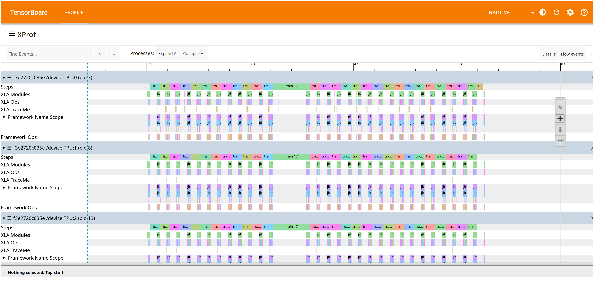
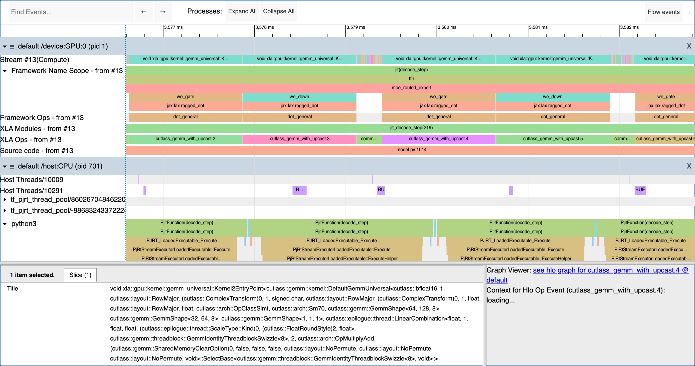
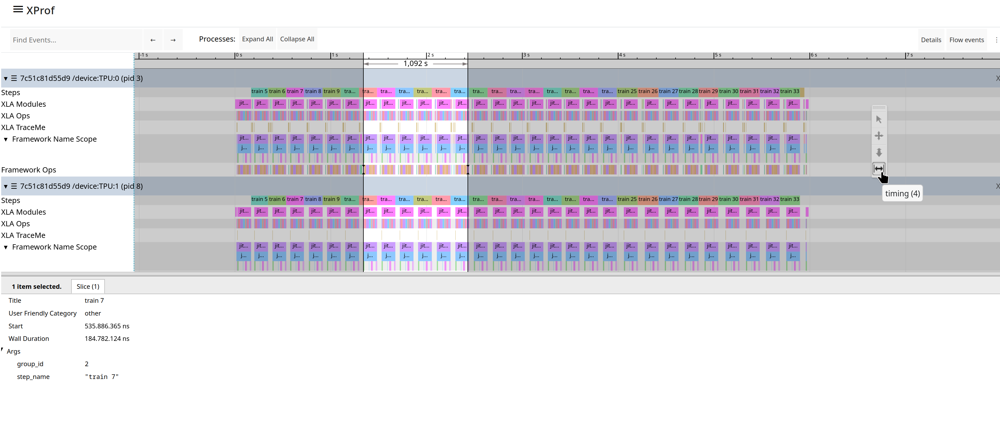
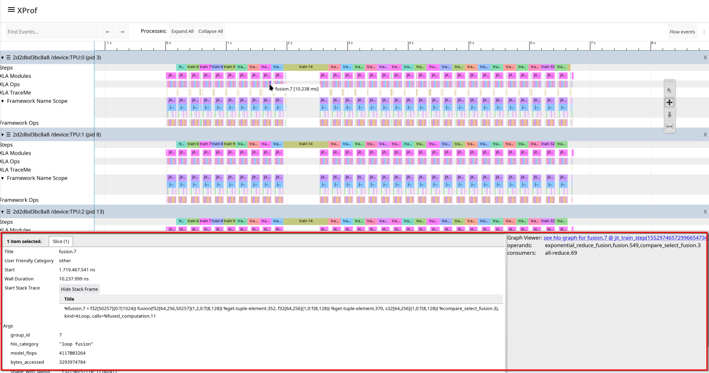
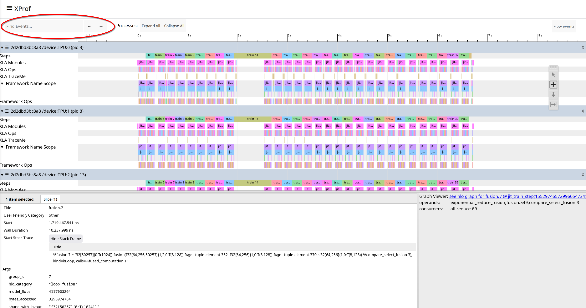
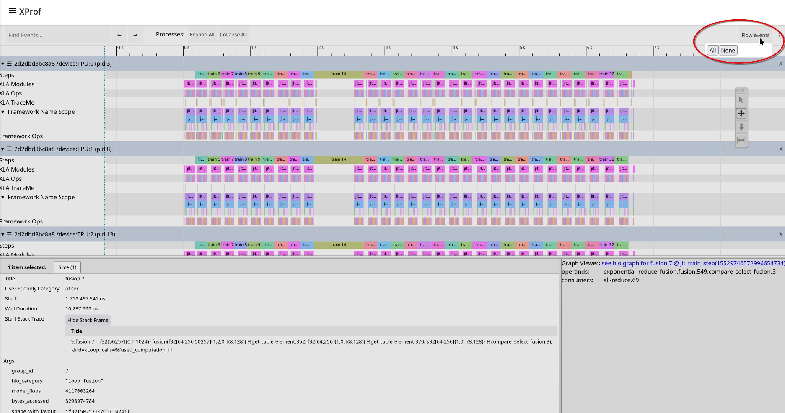

## Trace Viewer Tool

You can use Trace Viewer to visualize the timeline of events that occurred
during the profiling session. It displays the durations of operations executed
by your model on different parts of the system, such as the host (CPU) and
accelerators (GPUs or TPUs). This enables you to understand how your model
utilizes hardware resources, identify performance bottlenecks, and optimize your
model for faster execution.

### Supported Platforms

Both TPU and GPU are supported.

The Trace Viewer for GPUs groups events on timelines per GPU chip and the
streams within it, while for TPUs, it organizes events on timelines per TPU chip
and core. In either case, Trace Viewer also presents events on timelines
per-thread for the host CPU that the accelerators are connected to.

### Interacting with the Timeline

Trace Viewer provides several tools and methods for navigating and examining the
timeline:

*   Navigation: After clicking an event in the timeline, you can use the
    following keyboard shortcuts:
    *   **W:** Zoom in.
    *   **S:** Zoom out.
    *   **A:** Pan left.
    *   **D:** Pan right.
*   Tool selector: A floating tool selector contains tools you can use by
    clicking on corresponding icons, or by using the corresponding keyboard
    shortcuts:
    *   **Selection Tool (1 or !):** Click an event to select it and view its
        details in the Details pane. Select multiple events via ctrl+click to
        see a summary.
    *   **Pan Tool (2 or @):** Drag to move the timeline horizontally
        or vertically.
    *   **Zoom Tool (3 or #):** Drag to zoom into a specific area of
        the timeline.
    *   **Timing Tool (4 or $):** Drag to mark a time interval. The
        duration of the marked interval will be displayed. You can also use the
        'm' key to mark a selection and determine its total duration.
*   Zoom to selected events (f): Select one or more events and press the 'f' key
    to quickly zoom into that portion of the timeline. This is useful for
    focusing on a specific training step.

When handling a large number of trace events, Trace Viewer works in streaming
mode. This means it loads data on demand as you pan and zoom across the
timeline, similar to how map applications work. If you zoom faster than the data
can load, you might see a low-resolution representation of the data until it
finishes loading.

### Trace Viewer Interface Components

Here are the main UI components in Trace Viewer:

*   The time axis runs horizontally at the top, showing time relative to the
    start of the trace.
*   Timelines are organized by sections and tracks, with labels located on the
    left vertical axis. Each section represents a processing element (e.g., a
    device node or host threads) and can be expanded or collapsed. Within each
    section are tracks, which are timelines for specific activities.
*   Events are the colored, rectangular blocks on the timeline tracks,
    representing the duration of an operation or a meta-event like a training
    step. The color of the events does not have a specific meaning.
*   The details pane, which appears at the bottom of the timeline when one or
    more events are selected, shows additional information about the selected
    events, such as their name, start time and duration. When an XLA operation
    is selected, you can see links to the op in the
    [Graph Viewer](graph_viewer.md) tool and other information that can be made
    available by the framework and compiler, including pointers to source code
    and/or the Python stack trace, the framework op that caused this XLA op to
    get generated, etc. It may also show FLOPS (number of floating point
    operations executed by the op) and bytes accessed by the op. This
    information is statically acquired from XLA during compilation, rather than
    runtime information from the profile.

    

### Typical Sections and Tracks

Trace Viewer provides the following sections and tracks.

*   One section for each TPU node, with the following tracks:
    *   **Steps**: Shows the duration of the training steps running on that TPU
        core, if appropriately annotated in the user program or framework.
    *   **XLA Modules**: the XLA program being executed.
    *   **XLA Ops**: Shows the XLA HLO operations that ran on the TPU core. Each
        higher-level framework operation (JAX, Tensorflow, or PyTorch, for
        example) is translated into one or several XLA operations, which are
        then compiled to run on the TPU.
    *   **XLA TraceMe**: User-specified annotations in their code describing
        logical units of work they intend to track. You may still see data here
        even if you didn’t add any annotations; those are typically added by XLA
        (e.g., barrier cores), or XProf itself (e.g., dropped trace entries).
    *   **Framework Name Scope**: For each framework op, a visualization of the
        stack trace. For brevity, this track only appears for a single device.
    *   **Framework Ops**: Displays framework operations (JAX, Tensorflow, or
        PyTorch, for example) executed on the TPU core, if appropriately
        annotated in the user program or framework.
    *   **Source code**: Path to the source code being executed, if available in
        the profile.
*   One section for each Sparsecore node: Some TPU generations (e.g., TPU v5p
    and TPU v6e) are
    equipped with one or more SparseCore units in addition to the dense compute
    MXU units;
    modules, ops, and TraceMes associated with these cores will appear in this
    section.
*   One section for each GPU node, with the following tracks:
    *   One track per stream, with the stream name also including information
        about the types of operations executed on the stream (Memcpy, Compute,
        etc.).
    *   **Launch Stats**: Shows the max and average time spent in the launch
        phase.
    *   **Steps**, **XLA Modules**, **Framework Ops**, **Framework Name Scope**,
        **Source code**: These are all similar to TPU sections.
    *   **XLA TraceMe** is not supported for GPUs.
    *   **XLA Ops** do appear in GPU sections, but these are not currently
        always accurate, since they are derived from the stream data. They
        therefore can’t fully account for the GPU’s execution model where there
        may be an N:M mapping of XLA Ops to the actual kernels that get executed
        on the different streams, and the dynamic scheduling of multiple streams
        onto different SMs in the hardware.
*   One section for each component (e.g., one threadpool) running on the host
    machine's CPU, with one track per thread, in the case of threadpools. This
    is also where you will see Python traces if these were enabled during
    profile collection.

Note that only the XLA Ops for TPUs and stream data for GPUs are directly
grounded in the collected profile; all other lines are “derived lines”,
involving optional “sideband” information provided by the compiler, optional
user annotations, and/or heuristics applied by XProf. Therefore, these derived
lines may or may not appear in certain profiles.

### Other Features

*   You can search for specific event names using the “Find events..” search
    bar. Currently, this only searches within the visible time-window on screen,
    rather than the full trace.

    

*   **Flow Events**: Enabling this option by clicking the “Flow Events” button
    in the top bar adds visualizations, linking events in one thread or line to
    events in another thread line. For example, there may be an arrow drawn from
    the op on the host that enqueues or launches work for an accelerator, to the
    op on the accelerator that executes that work. XProf determines these links
    via a combination of user annotations, built-in heuristics, and by
    post-processing information it receives from different components (e.g.,
    CUPTI drivers, kernel launch IDs, TPU runtime information, etc.).

    
